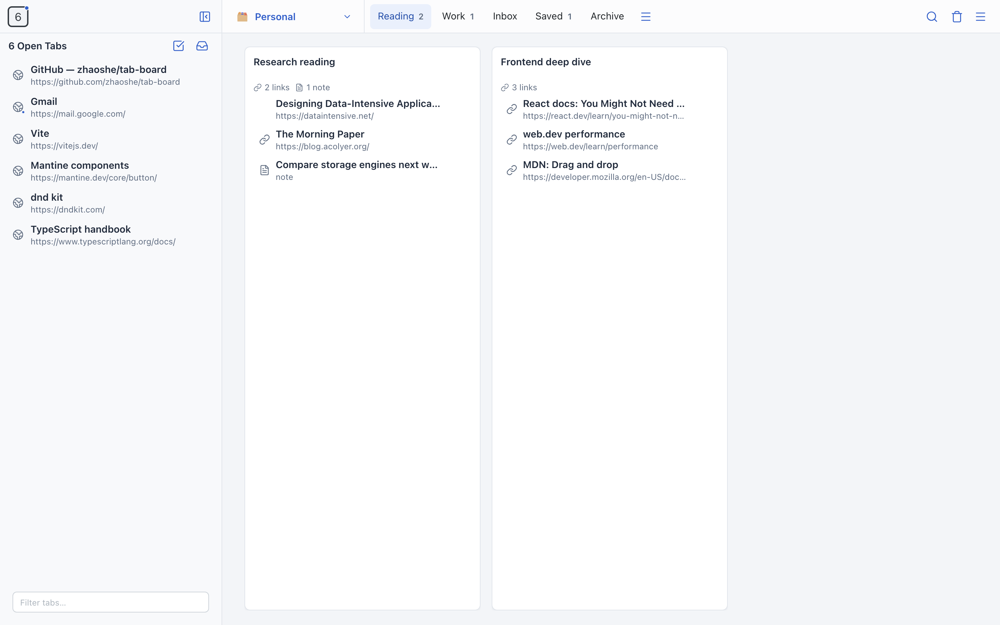
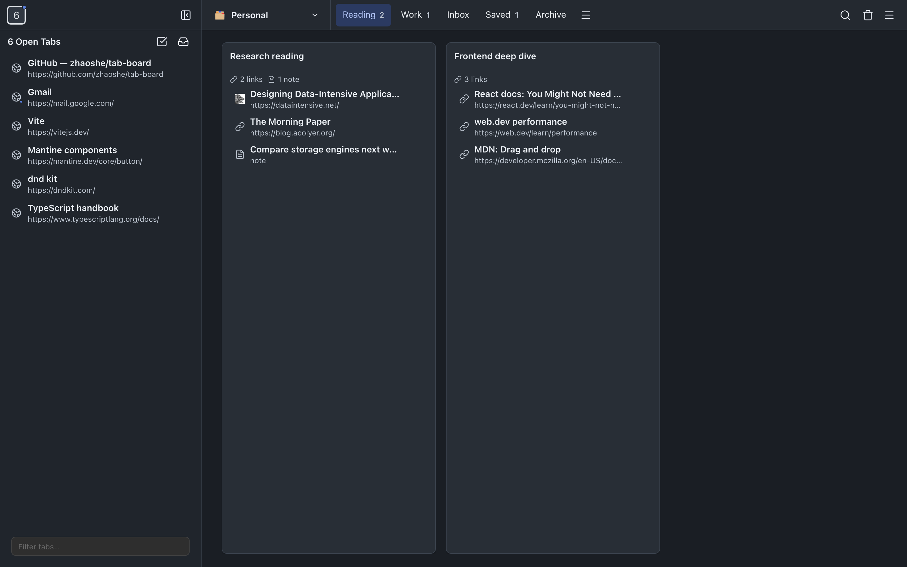
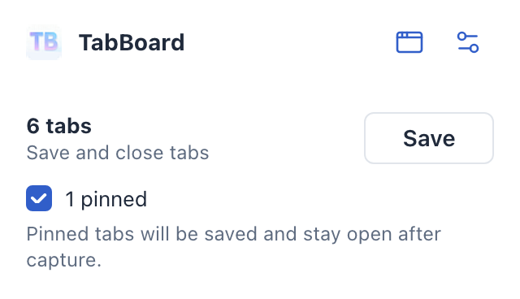
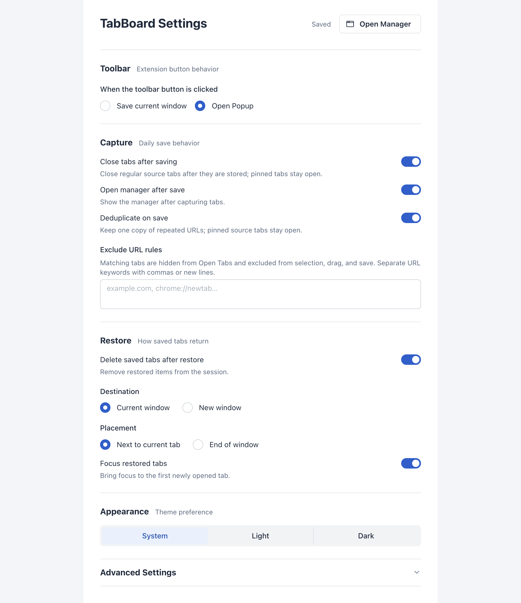

# TabBoard

[](LICENSE)

TabBoard is a local-first Chrome tab manager inspired by the OneTab and tabExtend workflows. It saves open tabs into searchable sessions, restores them later, supports workspaces, categories, notes, drag and drop, import/export, right-click capture actions, keyboard commands, and omnibox search.



TabBoard is a React 18 + TypeScript app built with Vite and packaged with `@crxjs/vite-plugin`. The UI uses Mantine v7 and Lucide icons, state is managed with Zustand, and drag and drop uses `@dnd-kit`. Data is stored in `chrome.storage.local` by default or in a user-selected local folder as a substitute backend.

## Requirements

- Google Chrome (or a Chromium-based browser) version 115 or newer.
- Node.js 18 or newer, only to build the extension from source.

## Build and Install in Chrome

1. Run `npm install` once to install dependencies.
2. Run `npm run build` to produce the extension bundle in `dist/`.
3. Open `chrome://extensions`.
4. Enable Developer mode.
5. Click Load unpacked.
6. Select the generated `dist/` folder.

For iterative development, run `npm run dev` to start the Vite dev server with hot reload.

By default, clicking the TabBoard toolbar button opens the compact popup. In Options you can switch the toolbar button to save the current window directly.

TabBoard also replaces Chrome's new tab page, so every new tab opens the TabBoard manager.

## Keyboard Shortcuts and Omnibox

- `Alt+Shift+B`: open the TabBoard manager.
- `Alt+Shift+1`: save all tabs in the current window.
- Type `tb` followed by a space in the address bar to search saved sessions from the omnibox.

Chrome shortcut keys can be customized at `chrome://extensions/shortcuts`.

## Permissions and Privacy

TabBoard is local-first and does not make any network requests. All saved sessions
stay on your machine in `chrome.storage.local` or in a local folder you select.

It requests only the permissions it needs to manage tabs:

- `tabs` and `tabGroups`: read and restore tabs and tab groups.
- `storage` and `unlimitedStorage`: persist sessions locally without a size cap.
- `contextMenus`: add right-click capture actions.
- `clipboardWrite`: support copy/export actions.

TabBoard requests no host permissions, so it cannot read the contents of any web page.

## Screenshots

TabBoard follows your system light or dark theme:



The compact popup for saving the current window, and the settings page:

<p>
  
  
</p>

## Product Docs

- [Docs index](docs/README.md)
- [Project overview](docs/project-overview.md)
- [Feature spec](docs/feature-spec.md)
- [Technical architecture](docs/technical-architecture.md)
- [Feature evolution](docs/feature-evolution.md)
- [Product decisions](docs/product-decisions.md)
- [Product story](docs/product-story.md)

## Main Features

- Save the current tab, current window, selected tabs, tabs left/right of the current tab, other tabs, or all windows.
- Save the current window from the manager's Open Tabs panel.
- Select multiple open tabs to create a new saved session or save into an existing session.
- Restore one tab, a group, selected tabs, or everything.
- Keep restored records when a group is locked.
- Preserve Chrome tab group metadata where Chrome allows it.
- Organize saved groups in a tabExtend-style manager with workspace/category controls in the top bar, a collapsible full-height Open Tabs sidebar, and horizontal session columns.
- Switch Chrome windows from sidebar chips and window actions, or create a new browser window without leaving the manager.
- Review one selected window in a single vertical Open Tabs list; pinned tabs stay inline with a badge.
- Attempt to save every tab with a URL except extension pages, including pinned tabs.
- Filter the selected window's rows from the sidebar footer without changing saved-session results.
- Drag saved tabs between sessions or onto an explicit new-session insertion target.
- Drag open tabs into an existing session or onto an explicit new-session insertion target.
- Filter saved sessions from an open tab's right-click menu.
- Drag sessions to reorder them across categories.
- Build a session from selected open tabs or save the selected browser window.
- Keep pinned tabs open after automatic capture and duplicate cleanup, even when they are saved.
- Replace Chrome's new tab page with the TabBoard manager.
- Search from the manager page, command palette, popup, or the address bar with `tb`.
- Add links and notes directly inside saved groups.
- Restore deleted groups and items from the bin.
- Import and export text or JSON.
- Import OneTab export text into separate TabBoard sessions.
- Configure duplicate handling, restore behavior, theme, and toolbar button behavior; Chrome shortcuts and settings reset remain in Advanced.
- Choose browser storage or a local-folder substitute backend; automatic file fallback preserves the configured folder and recovery status.

## Verify

```sh
npm run build
npm test
npm run check
git diff --check
```

## License

TabBoard is released under the [MIT License](LICENSE).
